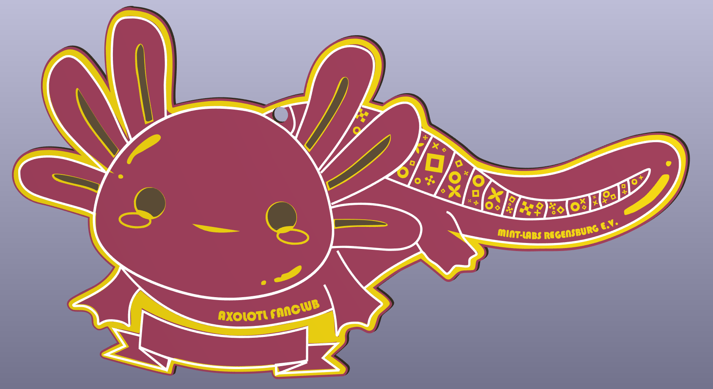
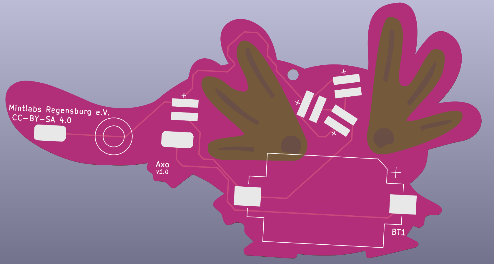

#Axolotl Fanclub Badge

Du bist bereits Fan der Mint-Labs Axolotl? Dann bist du sicher auch Fan der in Regenbogenfarbenen Axolotl-Badge! Nur für eingeweihte!

 

- Status: **Complete**
- Difficulty: **2/5**

### Parts List

| Description                   | Quantity |
|-------------------------------|----------|
| RGB LEDs 5mm                  |     4    |
| Button (SMD)                  |     1    |
| CR2032 Battery Holder (SMD)   |     1    |
| CR2032 Battery (not included) |     1    |

### Manual
You can find the manual and pictures of every step here: https://github.com/Binary-Kitchen/SolderingTutorial

### Copyright and Authorship

- Board: [CC-BY-SA 4.0](https://creativecommons.org/licenses/by-sa/4.0/) - [Timo from blinkyparts.com](https://shop.blinkyparts.com)
- Axolotl SVG [CC-BY-SA](https://creativecommons.org/licenses/by-sa/4.0/) - [Dani from Mint-Labs Regensburg e.V.](https://www.mint-labs-regensburg.de/

### Buy Soldering Kits
If you want to buy the parts and PCB for a soldering kit you can find everything here: [shop.blinkyparts.com](https://shop.blinkyparts.com/de/Regenbogen-Einhorn-Einfacher-Bausatz-fuer-einen-tollen-Anstecker/blink232242)
